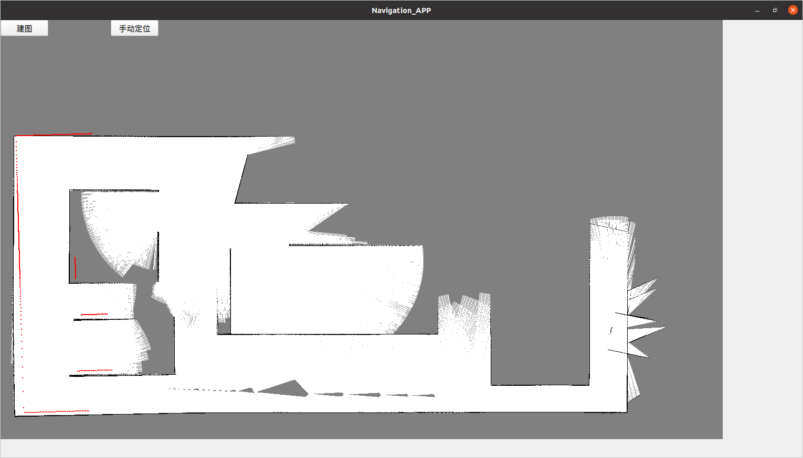
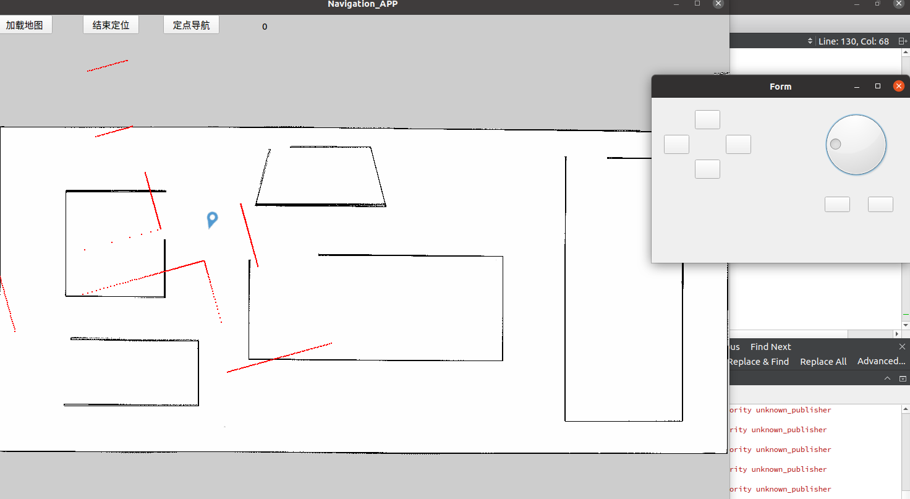
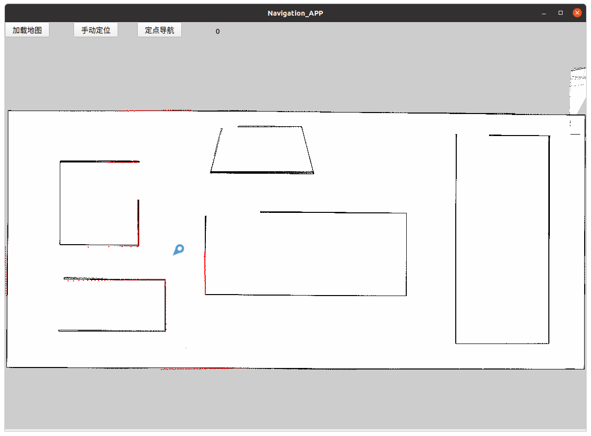
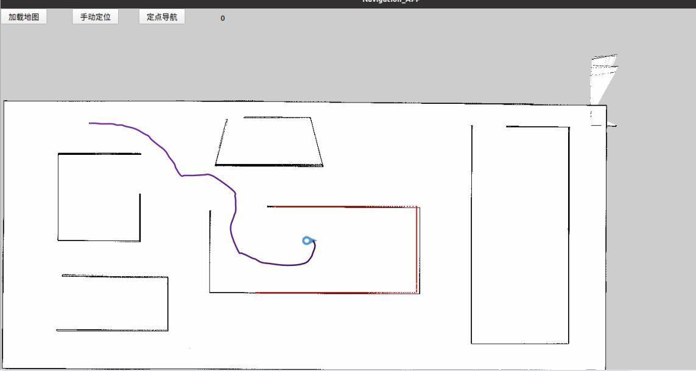

# 基于ros和qt的导航软件
## 说明：
### 当前这款导航软件只能给掌握ros开发人员使用，还达不到产品级别，虽然用到qt，但无法跨平台，目前存在以下致命弊端
### 1）目前这款软件绝大部分通信机制是ros话题和服务，只能在安装了ros的ubuntu系统下进行使用。
### 2）目前依赖开源节点太多，建图使用gmapping，定位使用蒙特卡洛，导航使用move_base，加载地图使用map_server。所以建图，导航，加载地图虽然能够使用，但是无法控制，例如无法结束建图，无法暂停/恢复导航。虽然move_base和map_server存在c++接口可以进行控制，但gmapping找不到能够控制的接口。
## 命令：
### roslaunch clean_ct06a gazebo.launch
### roslaunch clean_ct06a amcl.launch
### rosrun map_server map_server src/clean_ct06a/map/2dmap.yaml
### roslaunch clean_ct06a navigation.launch
## 使用过程：
## （可跳过）建图
### 过程现启动 gmapping才能点击建图按钮，这是个未解决问题，开源的gmapping结点无法进行控制，但可以观察建图过程：

## 加载
### 点击加载图片后，界面会显示地图，但同时需要用map_server进行加载
## 手动定位
### 使用了开源的蒙特卡洛定位算法，在加载地图后，需要告诉机器人所在位置和姿态：

## 导航
### 点击地图上的位置进行导航

## 总结
### 在建图时候订阅/map消息，随后按消息的数据绘制地图。在非建图时期，用图片替代消息数据，地图的绘制效率会高许多。
